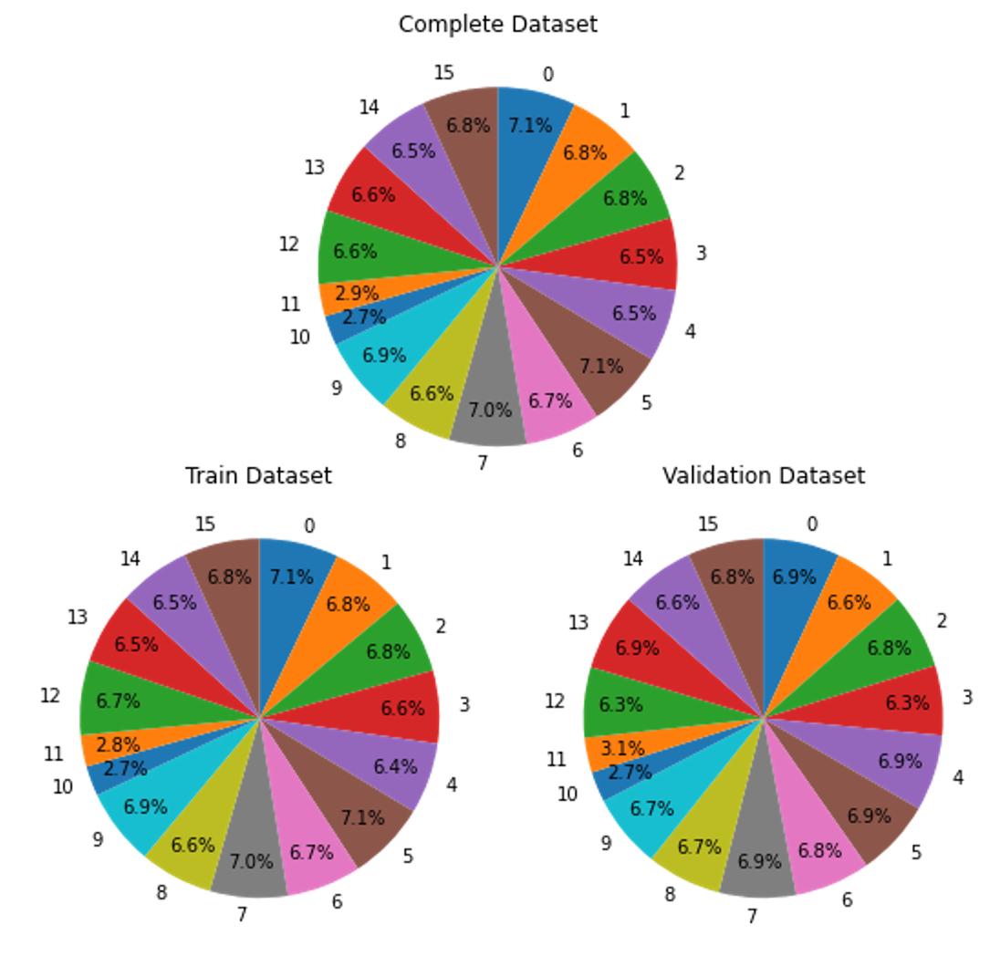
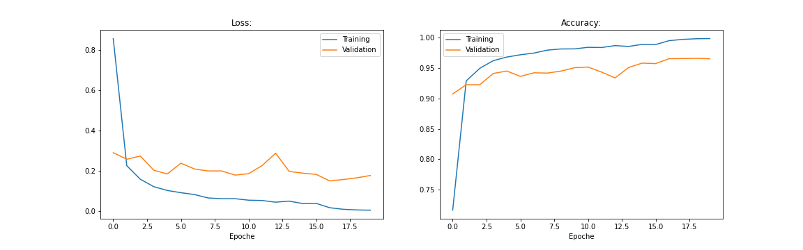
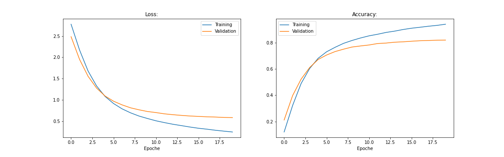
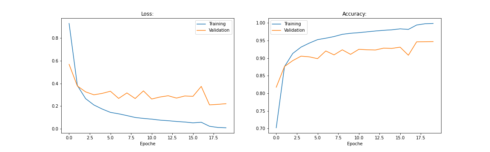

# Unicornn


**Content**
- [Training (Jupyter Notebook)](#training-(jupyter-notebook))
    - [Requirements](#requirements)
    - [Dataset](#dataset)
    - [Training Process](#training-process)
        - [Training Course](#training-course)
        - [Training Result](#Training-result)
        - [Pretrained Models](#pretrained-models)
- [Deployment (Unity 3D)](#deployment-(unity3d))
    - [Quick Start](#quick-start)
    - [Scene Overview](#scene-overview)
    - [Barracuda Setup](#barracuda-setup)
    - [General Information](#general-information)
        - [Models for Agent.cs](#models-for-agent.cs)
        - [Audio settings for MicrophoneInput.cs](#audio-settings-for-microphoneInput.cs)
        - [Python Background Process](#python-background-process)


## Training (Jupyter Notebook)

### Requirements

`pip install -r requirements.txt`

### Dataset

Download the [speech_commands_v0.02](http://download.tensorflow.org/data/speech_commands_v0.02.tar.gz) dataset from 
Warden P. (2018) and unpack it in the `Dataset` folder.

```
Dataset
├── data-speech_commands_v0.02
    ├── _background_noise_
    ├── backward
    ...
    └── zero
```

Warden, P.: Speech Commands: A Dataset for Limited-Vocabulary Speech Recognition (april 2018) https://arxiv.org/abs/1804.03209

We splitt the dataset in a train and tes dataset with the ration 80:20.



To train the model we use the mel-spectogram instead of raw audio for a better feature detection.


### Training Process

Run the jupyter notebook `train.ipynb`. The section "Params" at the top of the notebook allows ceratin settings like 
model type and optimizer type. After the notebook finished the folder `Weights` constints the trained weights (.pth) 
and model with trainied weights in the ONNX-format. 


#### Training Course 

We compared the VGG19BN and ResNet34 such as SGD and Adam.
All plots based on the Testdataset

**VGG19 + SGD-Optimizer**


**VGG19 + Adam-Optimizer (best result)**


**ResNet34 + SGD-Optimizer**


**ResNet34 + Adam-Optimizer**


#### Training Result


#### Pretrained Models

Download pretrained models from [here](https://fhd-my.sharepoint.com/:f:/g/personal/alexander_pech_study_hs-duesseldorf_de/EvkrOhMnV2FPg3neZAskSYMBLLowImHruOMhkVZpDKZKzw?e=chSJqx).


---
## Deployment (Unity3D)
[Verified for **2019.4.1f - Windows only**]
 * See our video tutorial **[Unicornn - HowTo](Docu/Demovideo.mp4)** for a quick **10 minutes introduction**
 * Contains the same information as the following **Readme.md**

### Quick Start 

1. Start **PlayMode** and wait till monitoring says **Python running** and circle is green
 - An background python process is initiated (see requirements.txt)
  > - librosa
  > - numpy
  > - datetime
  > - pylab
  > - PIL
  > - numba 0.48
 - You can activate console window by selecting **useShell [x]** in **GameManager -> PythonInterface.cs** to see process output
 - Process is terminated automatically after leaving PlayMode


2. Start voice recording by pressing **Start Button**
3. Say **two words** with silence (± 1 sec) in between
 - Check your Mic level with VU-Meter on the right side after first recording
 - Check **Treshold** if there's background noise (**GameManager** -> **MicrophoneInput.cs**)
 - Possible Words: *e.g:*  ***Zero*** [...] ***Left***

 |Objects| |Actions|
 |:------|:-:|:------:|
 |Zero| |Forward|
 |One| |Backward|
 |Two| |Left|
 |Three| |Right|
 |Four| |Up|
 |Five| |Down|
 |Six| ||
 |Seven| ||
 |Eight| ||
 |Nine| ||
4. Stop recording with **Stop Button** and wait
5. Word splitting and processing is done automatically
 - You can see the detected words and their probability next to our **Unicornn**

### Scene Overview

| **Unicornn**
* | **GameManager**
  * | **SpeechCommands.cs:** translate prediction to action in scene
  * | **MicrophoneInput.cs:** process microphone input, slice words, use threshold
  * | **PythonInterface.cs:** run background process (librosa) to create spectograms
* | **Agent**
 * | **Agent.cs:** take .onnx as model and input specotgrams from sliced words, find prediction
* | **SceneStuff**
 * | UI elements, buttons and visual elements

### Barracuda Setup

- **Barracuda** can be installed via the Unity **Unity PackageManager**. For futher informations look at: [https://docs.unity3d.com/Packages/com.unity.barracuda@0.7/manual/index.html](https://docs.unity3d.com/Packages/com.unity.barracuda@0.7/manual/index.html)
- Project was tested with **Barracuda 1.0.0**

### General Information

#### Models for Agent.cs

- You can exchange our different trained models by **Drag and Drop**
  - Just drag a different .onnx model to the field in Editor under **Agent** -> **Agent.cs**
  - By default we chose the model with the best results

#### Audio settings for MicrophoneInput.cs

- By default we chose a very low threshold to detect silence between words
- If you have a louder environment it could happen, that a "silent" moment is still above our threshold
  - Only change **GameManager** -> **MicrophoneInput** -> **Threshold** to a bigger value

#### Python Background Process

- We process the audio input in Unity3D, save the sliced float arrays as .wav and use librosa to generate mel-spectograms
- The background python process listens for existing file-names in the project folder and processes them if they exist
 - After processing the process deletes the .wav files for the next iteration
 - The script writes is own pid-ID to a text-file because it is started via cmd.exe
   - To terminate all processes we need the process-ID for all children-processes
 - By checking if process exited we can monitor the status of our background process
 > process.hasExited()

